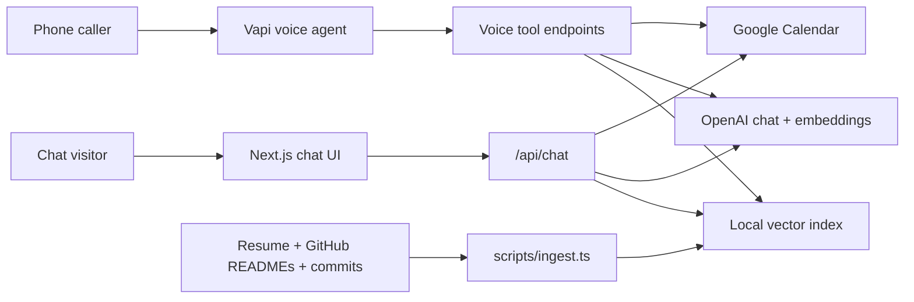

# AI Persona for Scaler Screening

This repository contains a live AI representative for Nishtha Pandey. It supports:

- Public RAG-grounded chat over resume and GitHub corpus
- Real calendar availability lookup and interview booking
- Vapi-compatible voice tool webhooks
- Lightweight eval harness for groundedness, latency, and failure-mode tracking

## Live Submission Links

- Public chat: `https://nishtha-scaler-ai.vercel.app`
- Voice agent phone number: `+1 609 447 8322`
- GitHub repository: `https://github.com/np-helios/ai-persona`

## Architecture



## Stack

- Next.js app routes for the public chat and provider webhooks
- OpenAI chat model for answer generation and tool use
- OpenAI embeddings for local vector retrieval
- Google Calendar API with OAuth refresh-token booking
- Vapi as the voice front end

## Setup

1. Install dependencies:

   ```bash
   npm install
   ```

2. Copy environment variables:

   ```bash
   cp .env.example .env.local
   ```

3. Add the real resume content to `corpus/resume.md`.

4. Fetch public GitHub context:

   ```bash
   GITHUB_USERNAME=np-helios npm run fetch:github
   ```

5. Build the vector index:

   ```bash
   npm run ingest
   ```

6. Run locally:

   ```bash
   npm run dev
   ```

7. Deploy to Vercel or any Node host and set the same environment variables.
   The production build fetches GitHub context, rebuilds the RAG index, and then
   runs `next build`.

## Calendar Booking

Enable Google Calendar API, create an OAuth client, generate a refresh token for Nishtha's Google account, and set:

- `GOOGLE_CALENDAR_ID`
- `PERSONA_EMAIL`
- `GOOGLE_CLIENT_ID`
- `GOOGLE_CLIENT_SECRET`
- `GOOGLE_REFRESH_TOKEN`

The booking tool checks `freebusy` immediately before inserting an event, then sends attendee updates and creates a Google Meet link.

## Voice Agent

Create a Vapi assistant with:

- Phone number: `+1 609 447 8322`
- First message: `Hi, I’m Nish-tha Paan-day’s AI representative. I can answer questions about her background, GitHub work, and help book an interview from her real calendar availability.`
- System prompt URL: `https://nishtha-scaler-ai.vercel.app/api/voice/system-prompt`
- Availability tool URL: `https://nishtha-scaler-ai.vercel.app/api/availability`
- Voice answer tool URL: `https://nishtha-scaler-ai.vercel.app/api/voice/answer`
- Booking tool URL: `https://nishtha-scaler-ai.vercel.app/api/vapi/tool`
- Header for secured Vapi webhook tools: `x-vapi-secret: YOUR_SECRET`

Add tools matching `docs/vapi-tools.json`. Use a low-latency model, Deepgram English (India), interruption/barge-in enabled, endpointing around 300-500 ms, and the same deployed URL for all tool calls.

## Evals

Run:

```bash
npm run eval
```

The current harness measures answer latency, source coverage, and simple golden-answer groundedness checks. For final submission, expand `evals/golden.json` to 25-50 questions across resume, repositories, adversarial prompt injections, and calendar booking.

## Cost Breakdown

Approximate costs depend on current provider pricing and corpus size.

- Chat session: one embedding for retrieval plus one or two chat completions, typically a few cents or less for short interviews.
- Voice call: Vapi/Twilio/telephony plus STT/TTS/LLM. Optimize by using a fast model, concise prompts, and tool calls only when needed.
- Calendar booking: Google Calendar API usage is negligible for this volume.

## Deployment Checklist

- Replace `corpus/resume.md` with real resume
- Run `npm run fetch:github`
- Run `npm run ingest`
- Run `npm run check:setup`
- Deploy chat URL
- Configure Vapi/Twilio number
- Test 10+ voice calls with interruptions
- Run groundedness evals and update `docs/eval-report.md`
- Fill `docs/eval-report.html` and print/export it as the required 1-page PDF
- Record the Loom walkthrough

For exact calendar, Vercel, Vapi, eval, and Loom steps, use `docs/submission-runbook.md`.
